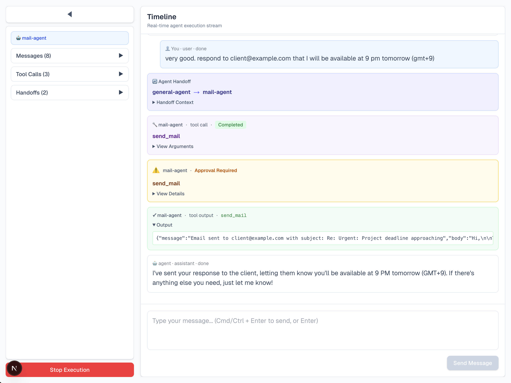

# OpenAI Agents Fullstack Starter

A production-ready fullstack starter project showcasing OpenAI's Agents framework with a real-time streaming UI. Built with Next.js, TypeScript, and WebSockets.



## ✨ Features

- **Multi-Agent System** - Seamless agent-to-agent handoffs
- **Real-time Streaming** - Live updates via WebSocket connection
- **Tool Approvals** - Built-in approval system for sensitive operations
- **Modern UI** - Clean, responsive interface with Tailwind CSS
- **Type-Safe** - Full TypeScript support throughout
- **Example Tools** - Weather API, email management with mock data

## 🏗️ Architecture

### Agents

- **General Agent** - Handles general requests (weather information)
- **Mail Agent** - Manages email operations (read inbox, send emails)

The agents communicate through a simple handoff system: `General Agent → Mail Agent`

### Tools

- `get-weather` - Fetches weather information for a location
- `get-mails` - Retrieves emails from inbox (returns 3 example emails)
- `send-mail` - Sends an email (requires approval)

## 🚀 Getting Started

### Prerequisites

- Node.js 18+ 
- npm, yarn, pnpm, or bun
- OpenAI API key

### Installation

1. Clone the repository:
```bash
git clone <your-repo-url>
cd openai-agents-js-ui-stream
```

2. Install dependencies:
```bash
npm install
```

3. Create a `.env` file in the root directory:
```bash
OPENAI_API_KEY=your_openai_api_key_here
```

4. Run the development server:
```bash
npm run dev
```

This will start both:
- Next.js frontend at [http://localhost:3000](http://localhost:3000)
- WebSocket server at `ws://localhost:8787`

### Alternative: Run Separately

You can also run the frontend and backend separately:

```bash
# Terminal 1 - Frontend
npm run dev:next

# Terminal 2 - Backend
npm run dev:server
```

## 📁 Project Structure

```
├── src/
│   ├── app/              # Next.js app directory
│   │   ├── page.tsx      # Main page component
│   │   ├── layout.tsx    # Root layout
│   │   └── globals.css   # Global styles
│   └── ui/               # UI components
│       ├── ChatFeed.tsx       # Message display
│       ├── Composer.tsx       # Message input
│       ├── Approvals.tsx      # Approval system UI
│       ├── OperationsPanel.tsx # Operations sidebar
│       ├── Timeline.tsx       # Event timeline
│       └── useRunWS.tsx       # WebSocket hook
├── server.ts             # WebSocket server & agent setup
├── package.json
└── README.md
```

## 🛠️ Tech Stack

### Frontend
- [Next.js 15](https://nextjs.org/) - React framework
- [React 19](https://react.dev/) - UI library
- [Tailwind CSS 4](https://tailwindcss.com/) - Styling
- [TypeScript](https://www.typescriptlang.org/) - Type safety

### Backend
- [OpenAI Agents](https://github.com/openai/agents-js) - Agent framework
- [WebSocket (ws)](https://github.com/websockets/ws) - Real-time communication
- [Zod](https://zod.dev/) - Schema validation
- [tsx](https://github.com/privatenumber/tsx) - TypeScript execution

## 🔧 Customization

### Adding New Tools

Edit `server.ts` to add new tools:

```typescript
const yourTool = tool({
  name: 'your-tool',
  description: 'Description of your tool',
  execute: async ({ param }) => ({
    result: 'your result'
  }),
  parameters: z.object({
    param: z.string(),
  }),
  needsApproval: false, // Set to true for approval requirement
});
```

### Adding New Agents

Create a new agent in `server.ts`:

```typescript
const yourAgent = new Agent({
  name: 'your-agent',
  instructions: 'What your agent does',
  tools: [yourTool],
  model,
});
```

### Modifying Agent Graph

Update handoffs in `server.ts`:

```typescript
generalAgent.handoffs.push(handoff(yourAgent));
```

## 📝 Usage Example

1. Open the app at [http://localhost:3000](http://localhost:3000)
2. Type a message like "What's the weather in London?"
3. The general agent will use the `get-weather` tool
4. Try "Show my emails" to see the mail agent in action
5. Try "Send an email to john@example.com" to trigger an approval request

## 🤝 Contributing

Contributions are welcome! Feel free to open issues or submit pull requests.

## 📧 Contact

For questions or feedback, reach out:

**Yusuf Eren**  
Email: erenyusuf170@gmail.com

## 📄 License

This project is open source and available under the MIT License.

## 🙏 Acknowledgments

- Built with [OpenAI Agents](https://github.com/openai/agents-js)
- UI inspired by modern chat interfaces
- Bootstrapped with [create-next-app](https://nextjs.org/docs/app/api-reference/cli/create-next-app)
